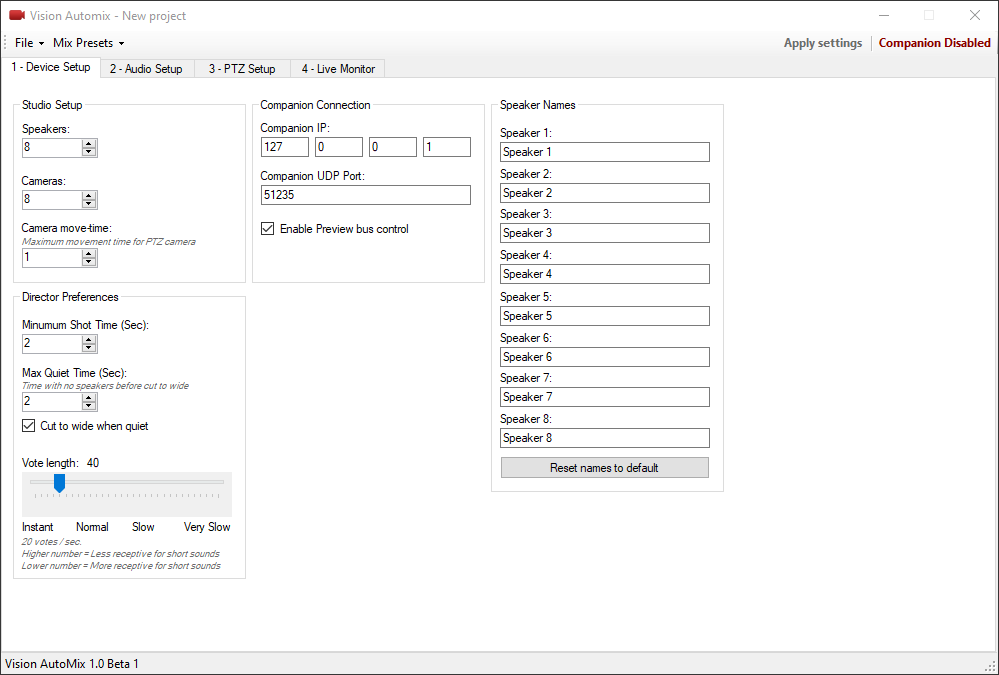

# Vision-Automix
**What is Vision Automix?** 
This application is a fully automated multi-camera production. This application is your camera operators, director and switcher all in one application.
Vision Automix takes control of your PTZ cameras and video switcher. It can listen to up to 8 speakers and can decide who is talking and what cameras are available for that speaker. If multiple people are talking the application will go to a wide shot.
  
**Who is it for?** 
This project is mostly suitable for radio stations, panel discussions and other similar situations where a full video production crew is not possible.
  
**How does it work?** 
Vision Automix listens on up to 8 separate audio channels, one for each speaker. 
To control the PTZ cameras and the video switcher the application relies on the third-party software [Companion](https://bitfocus.io/companion/). Basically you need to setup Companion-buttons to switch cameras on the video mixer and recall presets on the PTZ cameras. You then reference these buttons in Vision Automix. This makes the software mixer and camera agnostic and easier to adopt to new equipment.
  
**Screenshots**  
 
**1 - Device Setup** 
In this view you need to enter all the information about the production you are producing. 

**Studio Setup**
<ol>
<li>Speakers - Unique speakers in the production. Each need their own dedicated mic input and camera preset.</li>
<li>Cameras - Total amount of cameras, PTZ or static.</li>
<li>Camera move-time - The time it takes for your cameras to move from two extreme positions. This is used so that the software won't put the camera on PGM before it has had time to perform the move. </li>
</ol>

**Director Preferences**
<ol>
<li>Minimum Shottime - This is the minimum time that has to pass before cutting to a new camera.</li>
<li>Max Quiet Time - This is the maximum time where no one talks before cutting to a wideshot. Attention! If "Cut to wide when quiet" is unchecked this setting has no effect.</li>
<li>Vote Length - This slider basically decides for how long a speaker has to talk before being elected the current speaker.</li>
</ol>

**Companion Connection**
 
Enter the IP address to the [Companion](https://bitfocus.io/companion/) instance. The UDP port should be 51235 by default but can be changed in case Bitfocus decides to change this in the future.
 "Enable Preview bus control" will put whatever camera is preparing for the next shot in the preview bus on the video mixer. Turning this off will have no effect on the final product.
 

**Speaker Names**
 Here you can enter the names of all speakers in the production. This will only be visible inside of Vision Automix.

 
**2 - Audio Setup** 
In this view you will assign the speakers their individual audio channels. 
Select the audio capture device, specify the channel you want to listen to and set the gate threshold. 

**Known issues** 
If a audio device that is not selected as the "primary audio device" in Windows is not functioning, go into Windows audio-settings and turn on "Listen to this device". This will allow the input to come trough. 
If you are using Dante Virtual Soundcard is needs to run in WDM mode. ASIO is not currently implemented.

 
**3 - PTZ Setup** 
While this page may look daunting, do not worry! This page is where we reference Companion-buttons to the Automixer-functions. 
**Checkboxes** 
By default all checkboxes are unchecked. This is how you tell the application what camera have presets for what speakers. For example, if Camera 3 has a preset for speaker 4 - check the checkbox for speaker 4 in the yellow column. 
**Numbers** 
All number-boxes are used to reference the Companion-buttons. The first number is the Companion-page where the button is located. The second number is the actual button number on that page. 
For example, if you have a button to put Camera 5 on PGM on Companion Page 2 Button 5, set the numbers to "2" and "5" in the "PROGRAM" row and "Camera 5" column.

 
**4 - Live Monitor** 
This pages allows you to see what is going on with ease.  
**Preview** 
The green box lets you see what camera is up next and what speaker it is aiming at. 
**Program** 
The red box lets you see what camera is currently live and with what speaker. 
**Speakers** 
This list shows all speakers and their names light up whenever they speak. 
**Cameras** 
This list shows all cameras and tells you what camera is on air and also what speaker every camera is aiming at.
